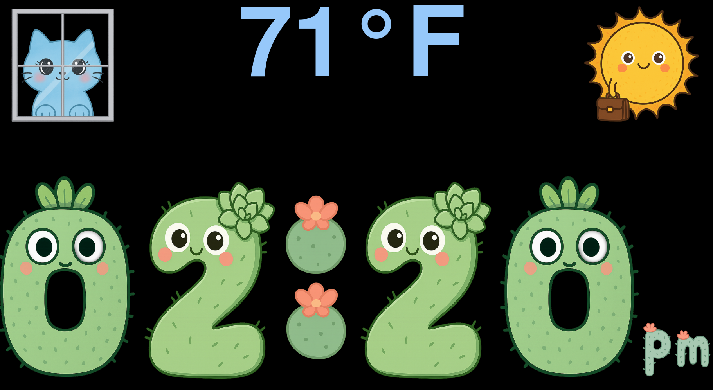

# The Clock

This project is a fullscreen image clock created as a gift meant to run on a small OLED display. It requires Python and Pygame and shows the time alongside current temperature and weather information, displayed as cute-styled characters. The project was done (almost) fully using OpenAI's suite of tools with minimal manual editing and image manipulation.

## Configuration

Settings are loaded from `config.json`. You can tweak brightness, colors, and endpoints for temperature and weather data. Images live under `images/<theme>/` and new themes can be added by creating additional folders.

```json
{
  "theme": "succulent",
  "brightness_day": 1.0,
  "brightness_night": 0.5,
  "temp_endpoint": "http://snek:8000/habitat/api/most_recent",
  "weather_endpoint": "http://snek:8000/weather/api/most_recent"
}
```

### Endpoints
The clock expects an endpoint that returns temperature in a JSON-format like:

```json
{ "Temperature": 72.0 }
```

Similarly, a weather API should return JSON containing the icon name used for the theme:

```json
{ "condition": "clear_day" }
```

## AI/ML Usage
This code was developed using [Vibe Coding](https://en.wikipedia.org/wiki/Vibe_coding) with OpenAI's Codex. The artwork was similarly generated using Sora. Minimal manual editing was used for both the coding and images.

## Screenshot



